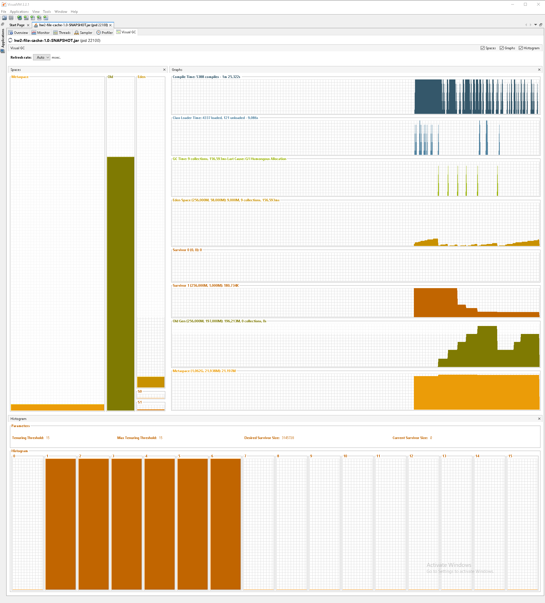
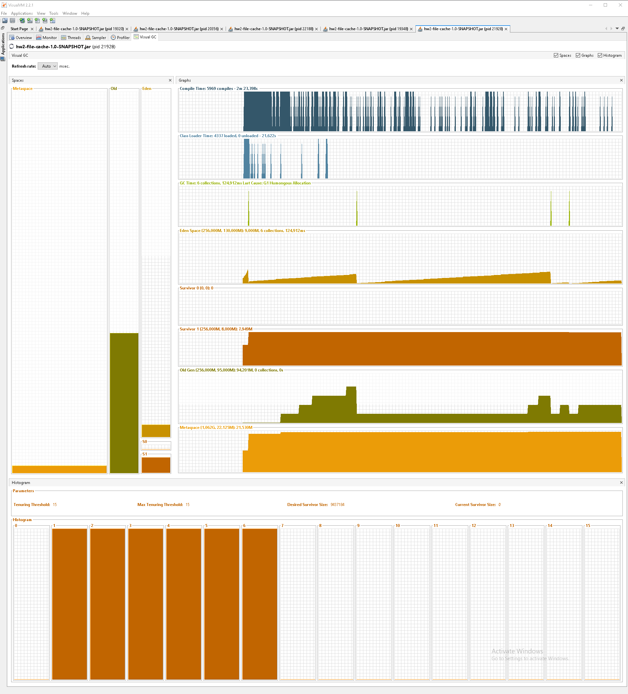

# hw2-file-cache

__Домашнее задание__
Использование SoftReference & WeakReference в кэшах

__Цель:__
Написать собственную имплементацию кеша с использованием WeakReference & SoftReference

__Описание/Пошаговая инструкция выполнения домашнего задания:__
1. Создать структуру данных типа кеш. Кеш должен быть абстрактный. То есть необходимо, чтобы можно было задать
ключ получения объекта кеша, и, в случае если его нет в памяти, задать поведение загрузки этого объекта в кеш:
- указать кэшируемую директорию
- загрузить содержимое файла в кэш
- получить содержимое файла из кэша

2. Создать программу, эмулирующую поведение данного кэша. Программа должна считывать текстовые файлы из системы
и выдавать текст при запросе имени файла. Если в кэше файла нет, кэш должен загрузить себе данные. По умолчанию в кеше
нет ни одного файла. Текстовые файлы должны лежать в одной директории. Пример: `Names.txt`, `Address.txt` - файлы в системе.
При запросе по ключу `Names.txt` - кеш должен вернуть содержимое файла `Names.txt`.

3. Создать в папке cache/menu класс Emulator для работы с пользователем. Предоставить пользователю возможности:
- указать кэшируемую директорию
- загрузить содержимое файла в кэш
- получить содержимое файла из кэша

__Критерии оценки:__
1. Созданы структуры, необходимые для реализации кэша
2. Весь функционал, описанный в задании отрабатывает должным образом
3. Соблюдены правила чистого кода:
- код легкочитаем
- есть обработка исключений и обработка сценариев, если что-то пойдет не так
- написаны тесты
Статус "Принято" ставится при выполнении первых двух пунктов

## Building
```shell
mvnw clean package
```

## Launching
```shell
# -Xmx256m - the max size of HEAP
java -Xmx256m -jar target/hw2-file-cache-1.0-SNAPSHOT.jar
```

## Explanation
После запуска приложения устанавливаем один из вариантов реализации кэша:
- 1 - `SoftReference`
- 2 - `WeakReference`

Вводим `1` (для примера) __SoftReference__.
Далее вводим команду `set-dir` - установка каталога хранения файлов.
Вводим каталог хранения `stporage`.

В корневом каталоге проекта есть папка `storage` в которой находятся текстовые файлы размером по 49140000 байт:
- [file1.txt](storage/file1.txt)
- [file2.txt](storage/file2.txt)
- [file3.txt](storage/file3.txt)
- [file4.txt](storage/file4.txt)
- [file5.txt](storage/file5.txt)
- [file6.txt](storage/file6.txt)

После установки каталога хранения, получаем файл.
Вводим команду `get-file` и вводим имя файла `file1.txt`.
Программа попытается найти указанный файл в кэше. Так как файла в кэше нет, программа загрузит файл в кэш и выведет
его содержимое в терминал.

Далее можно прочитать остальные файлы: `file2.txt`, `file3.txt`, `file4.txt`.

## Memory Analysis

Анализ памяти выполнялся в программе __VisualVM 2.2.1__

### SoftReference
Запускаем программу с реализацией кэша `SpftReference`.

На графиках видно постепенное заполнение области `Old Gen` во время загрузки файлов в кэш.
При простое приложения или очередноё загрузке файла, GC удаляет объекты `WeakReference` - это не позволяет
приложению словить ошибку `OutOfMemoryError`.
На графике видно как GC позволяет почти полностью заполнить область памяти.

### WeakReference
Запускаем программу с реализацией кэша `WeakReference`.

На графиках видно постепенное заполнение области `Old Gen` во время загрузки файлов в кэш.
При простое приложения или очередноё загрузке файла, GC удаляет объекты `SoftReference`.
На графике видно как GC удаляет объекты когда область памяти занята только на половину.
Даже при простое приложения GC со временем удалит объекты с `WeakReference`.