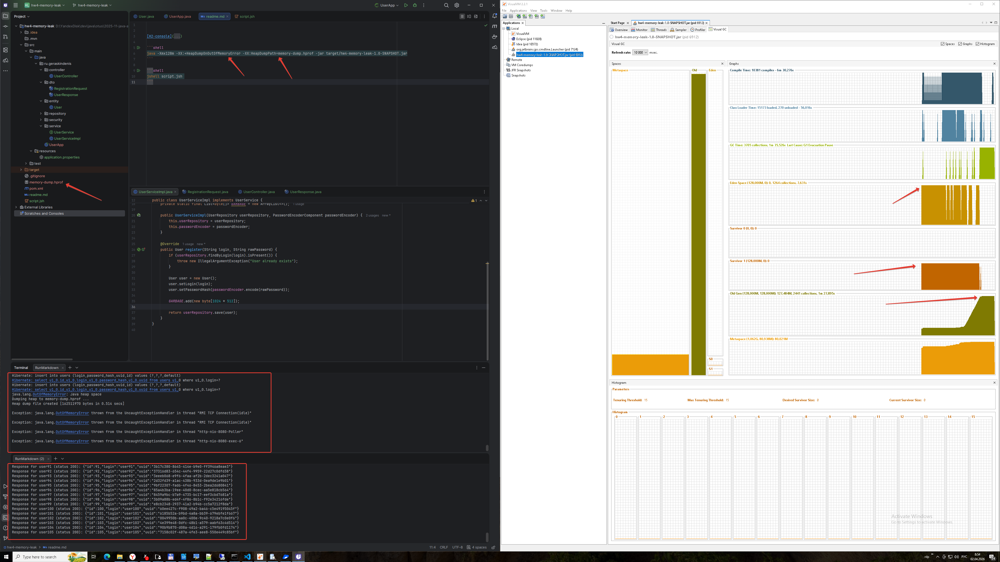
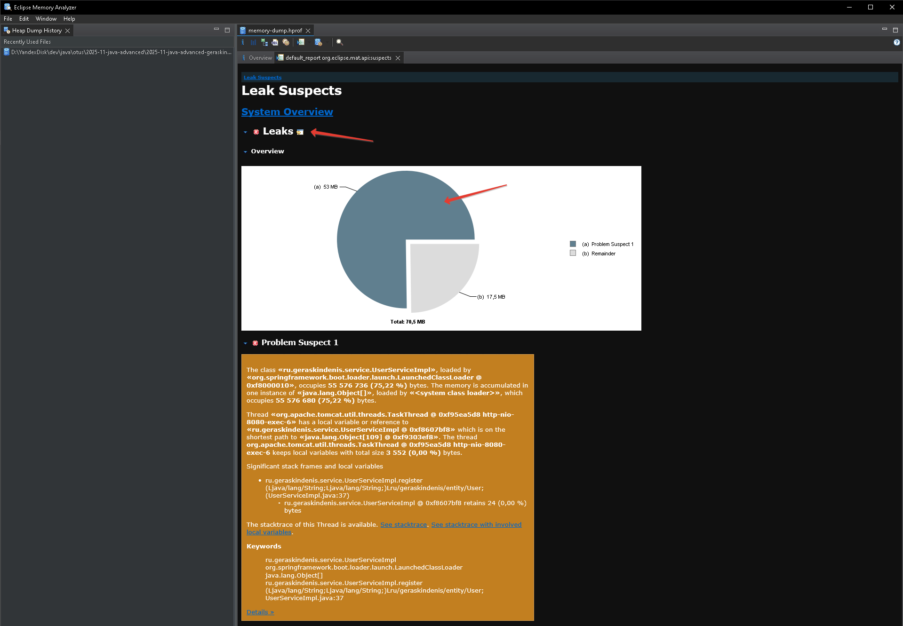
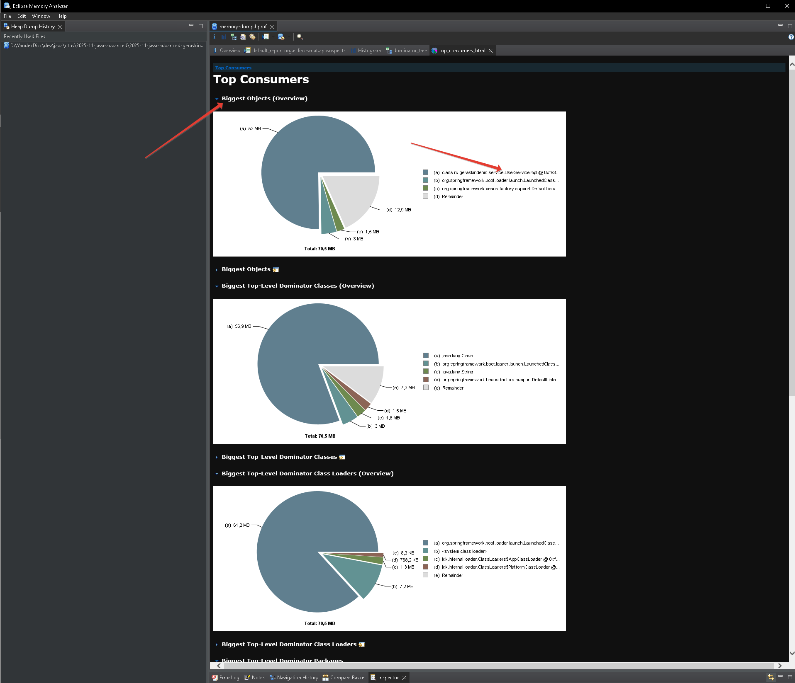
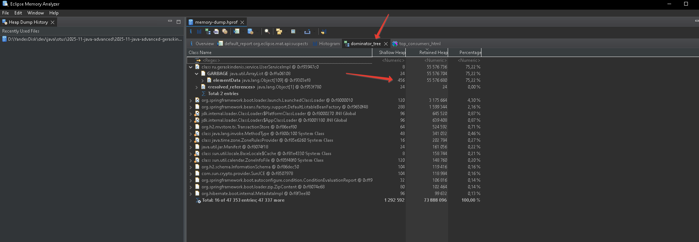

# hw4-memory-leak
## Домашнее задание
Поиск утечки памяти в приложении

__Цель:__
Создать тестовой приложение с утечкой памяти и найти её с помощью специальных инструментов

__Описание/Пошаговая инструкция выполнения домашнего задания:__

1. Реализовать простое приложение на spring boot:
1.1 Сервис регистрации пользователя в системе: rest service принимающий login и password от пользователя
1.2 Для хранения данных использовать БД H2
1.3 Для доступа к данным использовать Spring JPA
2. Заложить проблему, вызывающую OutOfMemoryError. Примечание: приложение должно постепенно копить мусор в течение
нескольких минут
3. Запускать приложение с инструкцией, позволяющей собирать дамп хипа перед падением
4. Провести анализ дампа инструментам Eclipse Memory Analyzer Tool, найти утечку, и предоставить скиншот того места,
где можно сделать вывод об утечку (с комментариями, поясняющими почему вы считаете это место утечкой)
5. Поправить утечку памяти (отдельным коммитом в пулл реквесте).

__P.S.__ Может показаться, что нужно реализовать лишнее, но данное приложение вы будете использовать в следующих ДЗ,
докручивая по заданию.

## Solution
Реализовано простое web-приложение для регистрации пользователей.
Данные пользователей сохраняются в БД:H2 (in memory).
В класс `UserServiceImpl` добавлено поле `GARBAGE` (коллекция), которая увеличивается
при каждом вызове метода `register()`.

### Settings
- [URL of APP](http://127.0.0.1:8080) - адрес публикации приложения
- [URL of user registration service](http://127.0.0.1:8080/user/register) - адрес сервиса регистрации пользователей
- Логин/Пароль СУБД H2: [sa]/[sa]
- [URL of the H2 console](http://localhost:8080/h2-console) - адрес СУБД H2

###  Building
```shell
mvnw clean package
```

### Launch app
При запуске приложения устанавливаем параметры JVM:
- `-Xmx128m` - уменьшаем размер HEAP для скорого достижения ошибки `OutOfMemoryError`
- `-XX:+HeapDumpOnOutOfMemoryError` - включаем автоматическое формирование __DUMP OF MEMORY__ при ошибке `OutOfMemoryError`
- `-XX:HeapDumpPath=memory-dump.hprof` - указываем путь к файлу для сохранения __DUMP OF MEMORY__
```shell
java -Xmx128m -XX:+HeapDumpOnOutOfMemoryError -XX:HeapDumpPath=memory-dump.hprof -jar target/hw4-memory-leak-1.0-SNAPSHOT.jar
```

### Executing POST-requests
Запускаем скрипт с помощью `jshell`, который выполняет регистрацию 1000 пользователей.
```shell
jshell script.jsh 
```
После кратковременной работы скрипта web-приложение упадет с ошибкой`OutOfMemoryError` и в корень проекта
сохранится __DUMP OF MEMORY__ в файл с именем `memory-dump.hprof`.

### Comments
В каталоге `screens/` сохранены снимки экрана:
-  - падение приложение и состояние памяти JVM в окне программы `VisualVM 2.2.1`.
На графиках видно постепенное заполнение HEAP во время выполнения POST-запросов.
-  - окно программы `Eclipse Memory Analyzer` с отчетом об утечки памяти.
-  - окно программы `Eclipse Memory Analyzer` с отчетом `Top Consumers`
на котором видно самые большие объекты, самые большие доминаторы, топ классов с большим количество объектов ит.д.
Подробно можно посмотреть в отчете [](reports/top-consumers.pdf).
-  - окно программы `Eclipse Memory Analyzer` с отчетом `dominator_tree`.
В нем видно самый большой доминатор, который содержит ссылки на другие объекты.

Все эти отчеты показывают состояние памяти в различных перспективах, что дает нам понять возможную причину утечки памяти.