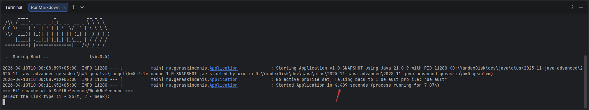
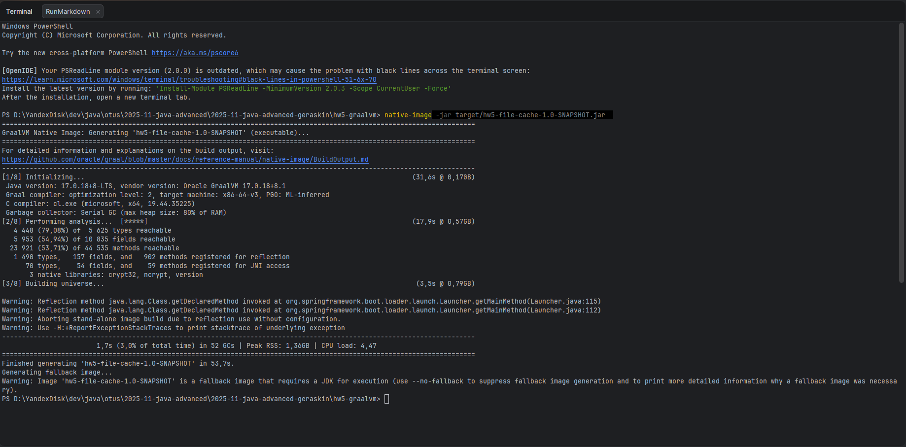
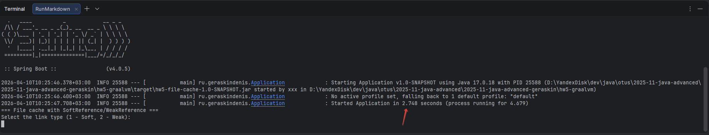
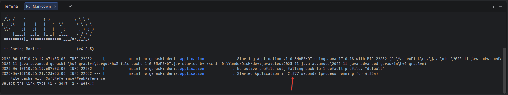

# hw5-graalvm

## Домашнее задание
Анализ ускорения работы приложения при работе на GraalVM

__Цель:__
Запустить ранее написанное приложение на GraalVM и оценить время старта и работы приложения (ускорение по отношению к обычной имплементации java)

__Описание/Пошаговая инструкция выполнения домашнего задания:__
Реализовать простое приложение на Spring Boot 3 (из занятия Memory management. JVM memory structure)

1. Добавить плагин для сборки Native Image файлов
2. Выполнить сборку в Native Image
3. Запустить полученный файл и сравнить время запуска с запуском на JVM
4. Зафиксировать результаты (можно указать железо на котором выполнялся запуск)
5. Добавить простой unit тест и запустить nativeTestCompiler (Gradle)
6. запустить файл в Docker

## Решение

### JAR-приложение

#### Building in JAR
```shell
mvnw clean package
```

#### Launching JAR
```shell
java -jar target/hw5-file-cache-1.0-SNAPSHOT.jar
```
Запуск JAR-файла №1:


Запуск JAR-файла №2:


Запуск JAR-файла №3:


Процесс запуска JAR-приложения занимает не более 6 секунд.

### EXE-приложение

#### Building in executable file
```shell
native-image -jar target/hw5-file-cache-1.0-SNAPSHOT.jar  
```
Процесс сборки EXE-файла:

Процесс сборки занял более 53 секунд на железе:
```log
Name                                       NumberOfCores
Intel(R) Xeon(R) CPU E5-2690 v4 @ 2.60GHz  16

TotalPhysicalMemory
34359177216
```

#### Launching EXE
```shell
./hw5-file-cache-1.0-SNAPSHOT.exe
```
Запуск EXE-приложения №1:


Запуск EXE-приложения №2:


Запуск EXE-приложения №3:


Процесс запуска EXE-приложения занимает не более 3 секунд.

__Из результатов видно, что EXE-приложение запускается в среднем в два раза быстрее JAR-приложения.__

### Launching in Docker

#### Building an image
```shell
docker build -t hw5-file-cache:v1 .
```

#### Creating container
```shell
docker create --name hw5-file-cache hw5-file-cache:v1 
```

#### Launching EXE
```shell
docker start -it --rm hw5-file-cache 
```